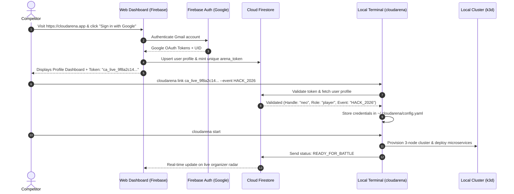
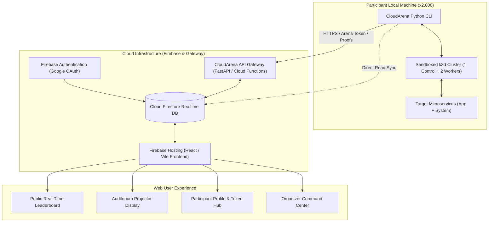
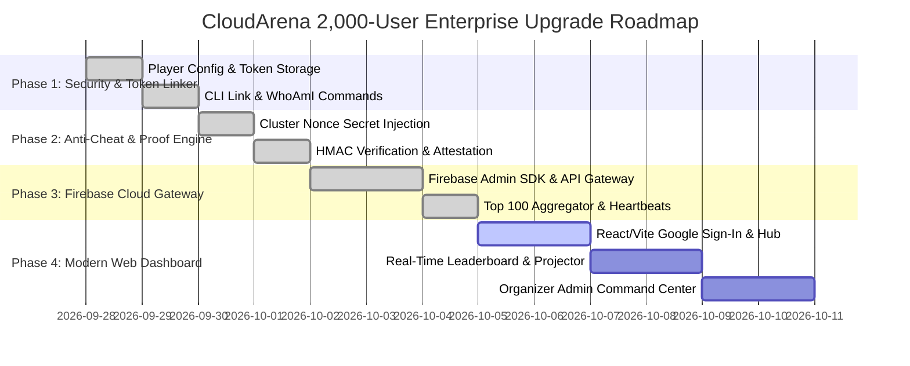

# 🌩️ CloudArena: Enterprise Hackathon Platform Architecture (2,000+ Concurrent Competitors)

> **Document Version:** 2.0.0  
> **Status:** Comprehensive Architecture, Benchmark & Implementation Blueprint  
> **Target Scale:** 2,000+ Concurrent Hackathon / Tournament Participants  
> **Core Objective:** Zero-cost compute, zero-lag tournament orchestration, cryptographic anti-cheat, token-based CLI authentication, and real-time live event control.

---

## 📑 Table of Contents

1. [Industry Benchmark & Competitive Landscape](#1-industry-benchmark--competitive-landscape)
   - [1.1 Feature Comparison Matrix (CloudArena vs. CTFd, Killercoda, LeetCode, HackTheBox)](#11-feature-comparison-matrix)
   - [1.2 CloudArena's Unfair Advantages](#12-cloudarenas-unfair-advantages)
2. [2,000-Concurrent Scale & Cost Engineering](#2-2000-concurrent-scale--cost-engineering)
   - [2.1 Financial Model: Cloud-Provisioned vs. CloudArena Local-First](#21-financial-model-cloud-provisioned-vs-cloudarena-local-first)
   - [2.2 Traffic & Firestore Quota Optimization](#22-traffic--firestore-quota-optimization)
   - [2.3 Adaptive Telemetry & Heartbeat Protocol](#23-adaptive-telemetry--heartbeat-protocol)
3. [Token-Based Authentication Architecture (Option B)](#3-token-based-authentication-architecture-option-b)
   - [3.1 Web User Journey (Google Sign-In & Token Minting)](#31-web-user-journey-google-sign-in--token-minting)
   - [3.2 CLI Token Linking (`cloudarena link <token>`)](#32-cli-token-linking-cloudarena-link-token)
   - [3.3 Security & Cryptographic Invariants](#33-security--cryptographic-invariants)
4. [Cryptographic Anti-Cheat & Proof-of-Resolution Engine](#4-cryptographic-anti-cheat--proof-of-resolution-engine)
   - [4.1 Why Simple REST Score Posting is Vulnerable](#41-why-simple-rest-score-posting-is-vulnerable)
   - [4.2 Ephemeral Cluster Salt & Cryptographic Attestation](#42-ephemeral-cluster-salt--cryptographic-attestation)
   - [4.3 Telemetry Sanity Verification](#43-telemetry-sanity-verification)
5. [Tournament Gamification & Competitive Features](#5-tournament-gamification--competitive-features)
   - [5.1 Solo vs. Team/Squad Modes](#51-solo-vs-teamsquad-modes)
   - [5.2 Dynamic Scoring & Solved-Count Decay](#52-dynamic-scoring--solved-count-decay)
   - [5.3 Leaderboard Freeze (Final Hour Excitement)](#53-leaderboard-freeze-final-hour-excitement)
   - [5.4 Live Spectator Radar & Auditorium Projector Mode](#54-live-spectator-radar--auditorium-projector-mode)
6. [Organizer Command Center & Admin Authority](#6-organizer-command-center--admin-authority)
   - [6.1 Event Lifecycle Management](#61-event-lifecycle-management)
   - [6.2 Wave Gatekeeper (Synchronized Waves vs. Open Campaign)](#62-wave-gatekeeper-synchronized-waves-vs-open-campaign)
   - [6.3 Granular Authority & Override Actions](#63-granular-authority--override-actions)
7. [Unified System Architecture & Data Schema](#7-unified-system-architecture--data-schema)
   - [7.1 End-to-End Component Diagram](#71-end-to-end-component-diagram)
   - [7.2 Cloud Firestore Database Schema](#72-cloud-firestore-database-schema)
8. [Codebase Delta & Necessary Updates to Existing Project](#8-codebase-delta--necessary-updates-to-existing-project)
9. [Step-by-Step Implementation Roadmap](#9-step-by-step-implementation-roadmap)

---

## 1. Industry Benchmark & Competitive Landscape

### 1.1 Feature Comparison Matrix

| Platform | Compute Model | Concurrency Limit | Cost per 2,000 Users | Real Kubernetes? | Gamified Chaos Waves? | Anti-Cheat Proof? | AI SRE Mentor? |
| :--- | :--- | :--- | :--- | :--- | :--- | :--- | :--- |
| **CTFd** | Server-side web quizzes | 5,000+ | Low (~$50/mo) | ❌ No (Static flags) | ❌ No | ⚠️ Flag sharing risk | ❌ No |
| **Killercoda / Katacoda** | Remote Cloud VMs (GCP/AWS) | 100–300 | **Extreme ($10k–$30k/day)** | ✅ Yes | ❌ Fixed tutorials | ❌ None | ❌ No |
| **SadServers** | Cloud EC2 instances | < 100 | High ($5k+/mo) | ⚠️ Single VM | ❌ Static script | ❌ None | ❌ No |
| **LeetCode Contests** | Isolated Sandbox Runner | 20,000+ | Moderate | ❌ Algorithms only | ❌ No | ✅ Code analysis | ❌ No |
| **CloudArena (Our Platform)** | **Local Sandboxed k3d on Laptop + Firebase Sync** | **5,000+** | **Zero Compute Cost (< $15/event on Firebase)** | **✅ Real 3-Node Cluster** | **✅ Escalating Live Attacks** | **✅ Cryptographic Attestation** | **✅ 3-Tier Progressive AI Mentor** |

### 1.2 CloudArena's Unfair Advantages
1. **Zero Cloud Infrastructure Cost:** 2,000 college or hackathon attendees create 2,000 3-node clusters. On AWS/GCP, this would require 6,000 VMs. On CloudArena, the compute runs on participants' laptops—saving $10,000–$25,000 per hackathon weekend.
2. **Zero Network Latency on kubectl:** Commands like `kubectl logs`, `kubectl top`, and `kubectl describe` execute locally at 0ms latency. No browser terminal lag.
3. **Offline Resilience:** If Wi-Fi blips during a 2,000-person university hackathon, participants can still troubleshoot and resolve waves locally; scores buffer and sync when connectivity returns.
4. **Pedagogical Depth:** Unlike CTFs that reward guessing strings, CloudArena produces an automated 1-page SRE Incident Post-Mortem teaching root-cause analysis (RCA) and production best practices.

---

## 2. 2,000-Concurrent Scale & Cost Engineering

### 2.1 Financial Model: Cloud-Provisioned vs. CloudArena Local-First

```text
SCENARIO: 2,000 PARTICIPANTS, 8-HOUR HACKATHON

TRADITIONAL CLOUD VM APPROACH (AWS EKS / GCP GKE):
- 2,000 clusters x 3 nodes = 6,000 worker nodes (t3.medium @ $0.0416/hr)
  = 6,000 x $0.0416 x 8 hrs = $1,996.80
- Managed Control Plane fee ($0.10/cluster/hr x 2,000 x 8 hrs)
  = $1,600.00
- Inter-AZ Data Transfer & NAT Gateways (~10GB/student x 2,000 x $0.09)
  = $1,800.00
----------------------------------------------------------------------
TOTAL CLOUD BILL PER HACKATHON: ~$5,396.80 to $12,000.00+

CLOUDARENA LOCAL-FIRST APPROACH:
- Participant Compute: $0.00 (Runs locally via k3d / Docker)
- Firebase Auth (Google Sign-In): $0.00 (Free tier covers 50,000 MAUs)
- Cloud Firestore (Optimized writes & cached reads): ~$5.00 to $15.00
- Firebase Hosting (Static React/Vite assets via CDN): $0.00
----------------------------------------------------------------------
TOTAL PLATFORM BILL PER HACKATHON: ~$10.00 to $20.00 (99.7% cost reduction!)
```

### 2.2 Traffic & Firestore Quota Optimization
Running 2,000 concurrent participants on Firebase requires strict write and read budgets:
* **Naive Approach (Catastrophic):** 2,000 clients sending 1 heartbeat per second = 2,000 writes/sec = 57.6 million writes/8 hrs = Firestore quota crash and high bills.
* **CloudArena Enterprise Protocol:**
  1. **Event-Driven Writes:** Telemetry is NOT streamed continuously. The CLI only writes to Firestore on **State Transitions**:
     - `ATTACK_INJECTED` (1 write)
     - `HINT_REQUESTED` (1 write)
     - `WAVE_RESOLVED` (1 write)
  2. **Adaptive Heartbeats (30-second interval):** While an incident is active, a compressed 200-byte heartbeat is sent once every 30 seconds (down from 1s), keeping total writes for 2,000 users to ~66 writes/sec—well within Firestore's 10,000 writes/sec limit.
  3. **Leaderboard Read Caching:** The public scoreboard does NOT query 2,000 participant documents individually. A background Cloud Function or periodic aggregator compiles the **Top 100 Standings** into a single cached document (`events/{id}/leaderboard/top100`) updated every 5 seconds. All 2,000 spectators and web visitors listen to **1 document**!

### 2.3 Adaptive Telemetry & Heartbeat Protocol

```json
{
  "uid": "usr_9f81a7b",
  "handle": "matrix_neo",
  "event_id": "hackathon_2026",
  "wave": 2,
  "status": "INCIDENT_ACTIVE",
  "elapsed_s": 142,
  "hints_used": 1,
  "cluster_telemetry": {
    "pod_count": 5,
    "restarts": 3,
    "traffic_success_pct": 74.5,
    "degradation_reason": "OOMKilled Exit 137"
  },
  "timestamp": 1790458920
}
```

---

## 3. Token-Based Authentication Architecture (Option B)

As requested, CloudArena implements **Option B: Personal Access Token (Arena Token)** for seamless CLI-to-Cloud linking.



### 3.1 Web User Journey (Google Sign-In & Token Minting)
1. User logs into CloudArena Web App with Google Account (`@gmail.com` or Google Workspace).
2. Firestore generates a cryptographically random token: `ca_live_<32_hex_chars>`.
3. The Web App displays an attractive card with a copyable terminal command:
   ```bash
   cloudarena link ca_live_9f8a2c14b3e8d910a7c4f5e6a1b2c3d4 --event HACKATHON_2026
   ```

### 3.2 CLI Token Linking (`cloudarena link <token>`)
* **Command Syntax:**
   ```bash
   cloudarena link <token> [--event <event_id>]
   ```
* **Validation:** The CLI contacts the CloudArena API / Firestore REST endpoint to verify token validity, fetch the user handle and event details, and writes the persistent session to `~/.cloudarena/config.yaml`.
* **WhoAmI Verification:**
   ```bash
   cloudarena whoami
   ```
   Outputs:
   ```text
   Logged in as: Aditya Patra (aditya@gmail.com)
   Handle:       neo_sre
   Event Bound:  HACKATHON_2026
   Cloud Status: Connected 🟢
   ```

---

## 4. Cryptographic Anti-Cheat & Proof-of-Resolution Engine

In a 2,000-person competitive hackathon with cash prizes or job interviews on the line, simple client-side REST submissions like `POST /score` are vulnerable to tampering (e.g. someone using Postman or Python to spam high scores).

### 4.1 Ephemeral Cluster Salt & Cryptographic Attestation
CloudArena introduces **Cryptographic Cluster Attestation**:

1. **Wave Initialization:** When `cloudarena wave start <N>` executes, the engine generates an ephemeral nonce and signs a secret verification challenge:
   $$\text{Challenge} = \text{HMAC-SHA256}(\text{ArenaToken}, \text{WaveNumber} + \text{ClusterUUID} + \text{Timestamp})$$
2. **K8s Secret Injection:** This cryptographic challenge is injected directly into the running Kubernetes cluster as a protected Secret inside `cloudarena-system`:
   `secret/cloudarena-incident-nonce`.
3. **Dynamic Chaos Signature:** The attack wave applies chaos that modifies the cluster state and incorporates this challenge.
4. **Resolution Proof:** When the participant resolves the issue and `is_resolved()` passes, the local engine extracts:
   - Pod termination timestamps and container logs
   - Final resource limits from K8s API
   - The cluster nonce from the internal secret
5. **Signed Proof Generation:**
   $$\text{Proof} = \text{HMAC-SHA256}(\text{ArenaToken}, \text{ResolvedTime} + \text{ElapsedSeconds} + \text{ClusterNonce})$$
6. **Server Verification:** The server (FastAPI gateway or Cloud Function) verifies that the `Proof` matches the expected mathematical signature before accepting the score into the official leaderboard!

---

## 5. Tournament Gamification & Competitive Features

### 5.1 Solo vs. Team/Squad Modes
* **Solo Track:** Every participant competes independently on their personal score.
* **Team Track (2–4 Competitors):**
  - Competitors join a team via a **Team Invite Code** on the web app.
  - Team Score Formulation:
    $$\text{Team Score} = \sum_{\text{members}} \text{Wave Scores} + \text{Collaboration Bonus}$$
  - Encourages pair programming and divided investigation (e.g., one member troubleshoots networking, another focuses on resource ceilings).

### 5.2 Dynamic Scoring & Solved-Count Decay
Inspired by competitive programming and CTFs:
* The first 10 participants to clear a wave receive a **Pioneer Bonus** (+50 pts).
* As more participants solve a wave, the base point value dynamically decays slightly (e.g., from 150 to 100) to reward innovators who crack tough problems first.

### 5.3 Leaderboard Freeze (Final Hour Excitement)
* During the final 30 minutes of the hackathon, the Admin can trigger **Scoreboard Freeze**:
  - Participants continue to submit scores and receive private confirmations.
  - The public leaderboard stops updating publicly to build intense suspense for the awards ceremony.
  - Admin unlocks **"The Great Reveal"** on the projector during closing ceremonies!

### 5.4 Live Spectator Radar & Auditorium Projector Mode
* **Projector Mode (`/projector`):** Ultra-dark, high-contrast, animated leaderboard designed for 4K auditorium projectors.
* **Live Radar:** Real-time ticker showing:
  - *"Alice just cleared Wave 2 in 1m 45s!"*
  - *"Team Kubernetes-Ninjas just overtook Team Chaos-Monkeys for 1st Place!"*

---

## 6. Organizer Command Center & Admin Authority

The Web App features an **Admin Command Center** accessible only to verified organizers.

```text
+----------------------------------------------------------------------------------------------------+
|  ORGANIZER COMMAND CENTER                                             [EVENT: HACKATHON_2026]     |
|                                                                                                    |
|  [Status: IN_PROGRESS]   [Mode: SYNCHRONIZED]   [Connected Laptops: 1,842]   [Frozen: NO]          |
+----------------------------------------------------------------------------------------------------+
|  TOURNAMENT CONTROLS                                                                               |
|                                                                                                    |
|  [▶ Start Event]   [⏸ Pause All Timers]   [❄ Freeze Scoreboard]   [🏁 Conclude & Export CSV]      |
+----------------------------------------------------------------------------------------------------+
|  WAVE ORCHESTRATION GATE                                                                           |
|                                                                                                    |
|  Wave 1: [RELEASED ✅] (Duration: 5m)  - 1,780 Cleared (96%)                                       |
|  Wave 2: [RELEASED ✅] (Duration: 7m)  - 1,420 Cleared (77%)                                       |
|  Wave 3: [LOCKED 🔒]   [🚀 Broadcast Wave 3 Now] (Duration: 8m)                                    |
|  Wave 4: [LOCKED 🔒]   (Duration: 10m)                                                             |
+----------------------------------------------------------------------------------------------------+
|  PARTICIPANT SUPERVISION & RADAR (1,842 Competitors)                                               |
|                                                                                                    |
|  Filter: [All] [Under Attack 🔴] [Stabilizing 🟡] [Stuck > 5m ⚠️]                                  |
|                                                                                                    |
|  • alice (Team Alpha)   | Wave 2 | 🟢 Stabilizing (8s) | Score: 285 | [Inspect] [Reset] [Disqualify] |
|  • bob (Solo)           | Wave 2 | 🔴 Under Attack     | Score: 180 | [Inspect] [Reset] [Disqualify] |
|  • charlie (DevOps Ops) | Wave 3 | ⚠️ CrashLoop (12r)  | Score: 390 | [Inspect] [Reset] [Disqualify] |
+----------------------------------------------------------------------------------------------------+
```

### 6.1 Granular Authority & Override Actions
* **Global Wave Release:** In Synchronized Mode, clicking "Broadcast Wave N" triggers a message on all 2,000 participant terminals within 1 second.
* **Emergency Wave Reset:** Admin can remotely reset a participant's environment if their local state is corrupted.
* **Audit Trail & Disqualification:** Admin can flag suspicious submissions (e.g. wave solved in 1.2 seconds) and disqualify fraudulent entries with one click.
* **1-Click CSV Export:** Generates complete CSV with rankings, emails, handles, wave times, and hint deductions for prize distribution.

---

## 7. Unified System Architecture & Data Schema

### 7.1 End-to-End Component Diagram



### 7.2 Cloud Firestore Database Schema

```text
firestore
├── users/ {uid}
│   ├── email: "competitor@gmail.com"
│   ├── displayName: "Alex Rivera"
│   ├── photoURL: "https://lh3.googleusercontent.com/..."
│   ├── handle: "arivera_dev"
│   ├── role: "admin" | "player"
│   ├── arena_token: "ca_live_9f81a7b4c2e1..."
│   └── created_at: Timestamp
│
├── events/ {eventId}
│   ├── title: "Global Cloud Hackathon 2026"
│   ├── status: "OPEN" | "IN_PROGRESS" | "PAUSED" | "CONCLUDED"
│   ├── mode: "self_paced" | "synchronized"
│   ├── is_frozen: false
│   ├── timing:
│   │   ├── opens_at: Timestamp
│   │   ├── closes_at: Timestamp
│   │   └── wave_durations: { "1": 300, "2": 420, "3": 480, "4": 600 }
│   ├── settings:
│   │   ├── max_hints: 3
│   │   ├── allow_resets: true
│   │   └── active_wave: 1
│   │
│   ├── cached_leaderboard/ "top100"  <-- HIGH-EFFICIENCY AGGREGATE CACHE FOR 2,000 SPECTATORS
│   │   ├── last_updated: Timestamp
│   │   └── standings: [ { rank: 1, handle: "...", score: 580, time: 240 }, ... ]
│   │
│   ├── participants/ {uid}
│   │   ├── handle: "arivera_dev"
│   │   ├── photoURL: "https://..."
│   │   ├── team_id: "squad_alpha"
│   │   ├── total_score: 380
│   │   ├── waves_cleared: 2
│   │   ├── total_time_seconds: 195
│   │   ├── live_wave: 2
│   │   ├── live_status: "INCIDENT_ACTIVE"
│   │   └── last_heartbeat: Timestamp
│   │
│   └── scores/ {scoreId}
│       ├── uid: "{uid}"
│       ├── handle: "arivera_dev"
│       ├── wave_number: 2
│       ├── net_score: 180
│       ├── elapsed_seconds: 120
│       ├── proof_signature: "hmac_sha256_..."
│       └── verified: true
```

---

## 8. Codebase Delta & Necessary Updates to Existing Project

The existing code built across Phases 1–6 is clean, modular, and serves as our engine foundation. Here are the precise updates required:

| Component | Existing File | Required Enhancement |
| :--- | :--- | :--- |
| **Config Model** | [`cloudarena/core/config.py`](file:///home/adityapatra/Documents/GitHub/CloudArena/cloudarena/core/config.py) | Add `arena_token`, `firebase_uid`, `team_id`, and `sync_mode` fields to `PlayerConfig`. |
| **CLI Commands** | [`cloudarena/cli/main.py`](file:///home/adityapatra/Documents/GitHub/CloudArena/cloudarena/cli/main.py) | Add `cloudarena link <token>` and `cloudarena whoami` commands. |
| **Token Linker** | New: `cloudarena/cli/link_cmd.py` | Implement token verification and storage into local YAML. |
| **Cryptographic Attestation** | New: `cloudarena/attestation/proof.py` | Injects cluster secret challenge on wave start, generates HMAC-SHA256 signature on wave resolution. |
| **Adaptive Heartbeat** | [`cloudarena/scoring/sync.py`](file:///home/adityapatra/Documents/GitHub/CloudArena/cloudarena/scoring/sync.py) | Add background 30s heartbeat sender and signed score submission with proof verification. |
| **Backend & Cloud API** | [`cloudarena/backend/api/app.py`](file:///home/adityapatra/Documents/GitHub/CloudArena/cloudarena/backend/api/app.py) | Integrate `firebase-admin` SDK, token verification, and Top 100 cache aggregator. |
| **Frontend Web App** | New: `web/` (React + Vite + Tailwind) | Complete web app with Google Sign-In, Live Leaderboard, Projector Display, User Profile Hub, and Admin Command Center. |

---

## 9. Step-by-Step Implementation Roadmap



