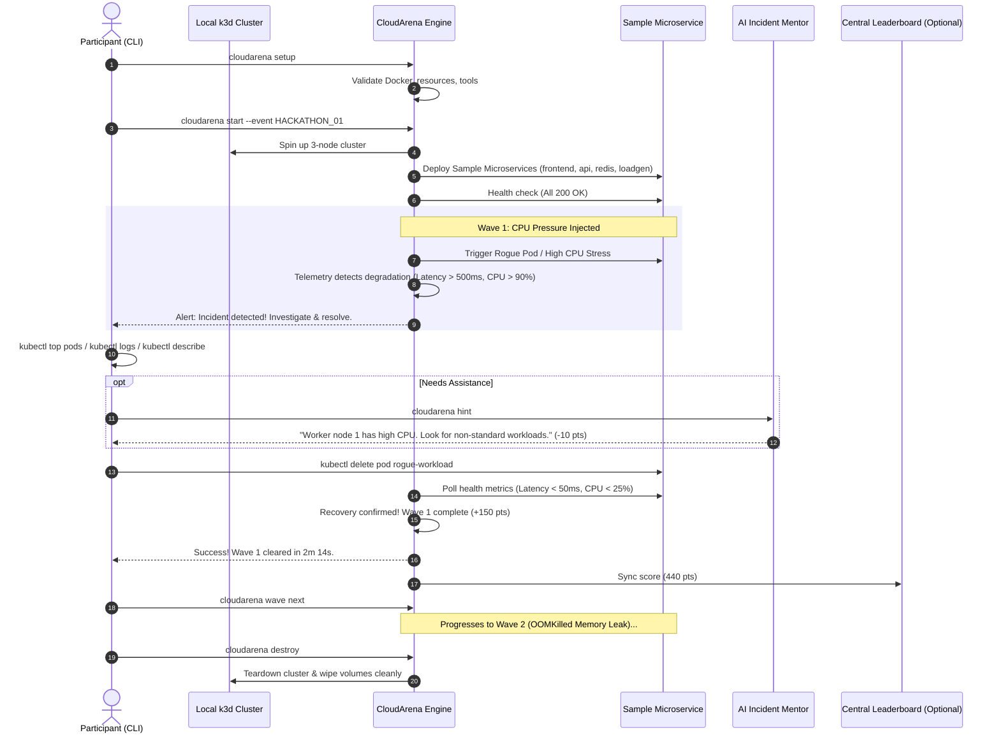
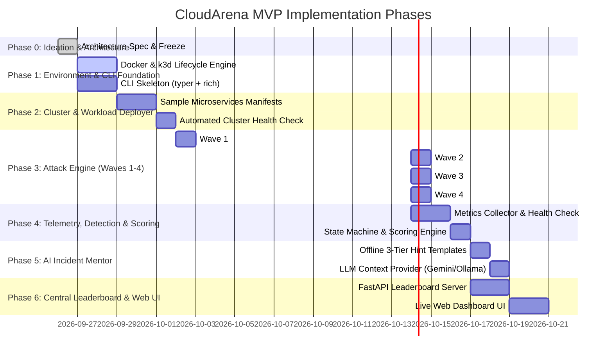

# 🌩️ CloudArena: Comprehensive Ideation, System Specification & Implementation Roadmap

> **Document Version:** 1.0.0  
> **Status:** Ideation & Architecture Specification (Pre-Implementation Baseline)  
> **Author:** CloudArena Team  
> **Target Audience:** Core Contributors, Workshop Organizers, Event Participants  

---

## 📑 Table of Contents

1. [Executive Summary & Core Philosophy](#1-executive-summary--core-philosophy)
2. [End-to-End User Experience & Game Loop](#2-end-to-end-user-experience--game-loop)
3. [System Architecture](#3-system-architecture)
4. [Component Deep Dives](#4-component-deep-dives)
   - [4.1 CLI Agent (`cloudarena`)](#41-cli-agent-cloudarena)
   - [4.2 Local Cluster Engine (`k3d` Orchestrator)](#42-local-cluster-engine-k3d-orchestrator)
   - [4.3 Sample Target Application](#43-sample-target-application)
   - [4.4 Sandboxed Attack Engine](#44-sandboxed-attack-engine)
   - [4.5 Telemetry & Incident Detection Engine](#45-telemetry--incident-detection-engine)
   - [4.6 AI Incident Mentor](#46-ai-incident-mentor)
   - [4.7 Scoring & Leaderboard Engine](#47-scoring--leaderboard-engine)
5. [Predefined Attack Scenarios (Waves 1 to 4)](#5-predefined-attack-scenarios-waves-1-to-4)
6. [Security Model & Sandboxing Guardrails](#6-security-model--sandboxing-guardrails)
7. [Technology Stack & Dependency Matrix](#7-technology-stack--dependency-matrix)
8. [Step-by-Step Implementation Roadmap](#8-step-by-step-implementation-roadmap)
9. [Pre-Implementation Checklist & Decisions Locked](#9-pre-implementation-checklist--decisions-locked)

---

## 1. Executive Summary & Core Philosophy

**CloudArena** is a zero-cost, gamified educational platform where engineers, students, and DevOps practitioners learn Kubernetes troubleshooting by surviving automated, escalating infrastructure attacks in a safe, locally sandboxed environment.

### The Problem It Solves
* **Prohibitive Cloud Cost:** Traditional cloud-based Kubernetes training (AWS EKS, GCP GKE) incurs significant per-student hourly VM and managed control plane costs ($30–$100/day for workshops).
* **Passive Learning:** Reading documentation or running pre-packaged tutorials lacks the visceral stress and problem-solving rhythm of actual on-call production incidents.
* **Fragile Environments:** Shared clusters lead to "noisy neighbor" issues where one student's command crashes another's environment.

### Core Philosophy
1. **Zero-Cost, Local-First:** Runs 100% locally on the participant's laptop inside Docker using `k3d` (K3s in Docker). No cloud accounts or credit cards required.
2. **Standardized Battlefield:** Every participant starts with an identical, isolated cluster (1 control plane, 2 worker nodes, 1 sample microservice application).
3. **Escalating Waves:** Chaos is injected in discrete, timed stages (CPU pressure, OOM leaks, broken probes, traffic surges).
4. **Sandboxed Safety:** Attacks are strictly restricted to Kubernetes primitives in defined namespaces. Zero arbitrary host shell command execution.
5. **Guidance Without Spoilers:** An AI Incident Mentor provides progressive, tiered hints (Directional $\rightarrow$ Diagnostic $\rightarrow$ Solution Clue) with dynamic point penalties.
6. **Network-Resilient:** The entire game loop (attacks, detection, hints, scoring) operates completely offline. A central server is purely used for live event leaderboard aggregation.

### 1.1 High-Impact Product Improvements & Differentiators

To elevate CloudArena from a standard workshop exercise into an exceptional learning product, four key improvements are incorporated:

1. **Self-Healing Tooling & Kubeconfig Isolation (`~/.cloudarena/bin/`)**:
   - Participants frequently lack `k3d` or `kubectl`, or risk corrupting existing work/production clusters in `~/.kube/config`.
   - *Improvement*: CloudArena auto-detects and installs isolated binaries into `~/.cloudarena/bin/` if missing, directs all operations to an isolated `~/.cloudarena/kubeconfig.yaml`, and provides an embedded proxy `cloudarena kubectl` so the user's host environment is never contaminated.
2. **Automated Incident Post-Mortem ("The SRE Learning Loop")**:
   - Beyond awarding points, each completed wave generates a structured 1-page Post-Mortem in terminal and markdown:
     - **Root Cause Analysis (RCA)**: Technical mechanics of why the failure occurred.
     - **Timeline & Telemetry**: Time to detect (TTD) vs. Time to resolve (TTR).
     - **SRE Prevention Guide**: Real-world prevention tips (e.g. setting CPU request/limit ratios, graceful pod termination, probe tuning).
3. **Instant Declarative Wave Snapshot Reset (< 3s)**:
   - If a participant mistakenly deletes core deployments or breaks the cluster during a wave, rebuilding the cluster takes 25–30 seconds.
   - *Improvement*: CloudArena stores pristine declarative snapshots for each wave; `cloudarena reset` reapplies clean manifests instantly in under 3 seconds without recycling the cluster nodes.
4. **Dual Modes: Solo Practice Campaign vs. Live Arena Tournament**:
   - **Solo Mode**: Self-paced offline career mode with persistent progress and resume capability.
   - **Arena Mode**: Real-time synchronized wave progression coordinated with a live organizer event and leaderboard broadcast.

---

## 2. End-to-End User Experience & Game Loop



### Participant Game Loop Steps
1. **Setup:** Participant runs `cloudarena setup`. Verifies Docker daemon access, memory availability (min 4GB allocated to Docker, 8GB host RAM recommended), and downloads local lightweight dependencies.
2. **Start:** Participant runs `cloudarena start`. A 3-node cluster (`cloudarena-cluster`) is provisioned via `k3d` in under 30 seconds. The sample application is deployed and verified healthy.
3. **Attack Wave Triggered:** The engine initiates a challenge wave. The problem manifests in real cluster metrics and pod statuses.
4. **Investigation:** The participant inspects the cluster using native tools (`kubectl get pods`, `kubectl describe`, `kubectl logs`, `kubectl top`).
5. **Hint Request (Optional):** If stuck, the participant requests an AI hint via `cloudarena hint`. Points are deducted accordingly.
6. **Resolution:** The participant applies the corrective action (e.g., editing deployment YAML, killing rogue pods, adjusting resource limits, fixing probes).
7. **Verification & Scoring:** The engine detects healthy state sustained for a stabilization window (e.g., 15 seconds), computes the score based on survival time and penalties, and advances to the next wave.
8. **Teardown:** When finished, `cloudarena destroy` completely wipes the cluster and associated Docker resources.

---

## 3. System Architecture

```text
+-----------------------------------------------------------------------------------+
|                              PARTICIPANT LAPTOP                                   |
|                                                                                   |
|  +-----------------------------------------------------------------------------+  |
|  |                            CLOUDARENA CLI                                   |  |
|  |   [setup]   [start]   [status]   [hint]   [wave]   [reset]   [destroy]       |  |
|  +---------------------------------------+-------------------------------------+  |
|                                          |                                        |
|  +---------------------------------------v-------------------------------------+  |
|  |                          LOCAL AGENT CORE                                   |  |
|  |                                                                             |  |
|  |   +-------------------+  +--------------------+  +-----------------------+  |  |
|  |   |   k3d Orchestrator|  | Sandboxed Attack   |  | Telemetry & Incident  |  |  |
|  |   |   (Cluster Mgmt)  |  | Engine (Waves 1-4) |  | Detection Engine      |  |  |
|  |   +---------+---------+  +---------+----------+  +-----------+-----------+  |  |
|  |             |                      |                         |              |  |
|  |   +---------v----------------------v-------------------------v-----------+  |  |
|  |   |           AI Incident Mentor (Offline Templates + LLM API)           |  |  |
|  |   +----------------------------------------------------------------------+  |  |
|  |   |           Local Scoring & Persistence Engine (SQLite / JSON)         |  |  |
|  +---+----------------------------------------------------------------------+--+  |
|      | Kubernetes API (Python Client)                                             |
|  +---v-------------------------------------------------------------------------+  |
|  |                   LOCAL KUBERNETES CLUSTER (k3d / Docker)                   |  |
|  |                                                                             |  |
|  |  [Namespace: cloudarena-system]         [Namespace: cloudarena-app]          |  |
|  |   - Metrics Server (Built-in)            - Frontend Service (Nginx / Web)   |  |
|  |   - Chaos / Stress Injector              - Backend API (Python / FastAPI)   |  |
|  |   - Traffic Generator (Locust)           - Cache / Store (Redis)            |  |
|  +-----------------------------------------------------------------------------+  |
+------------------------------------------+----------------------------------------+
                                           | HTTPS / WebSockets (Optional Sync)
+------------------------------------------v----------------------------------------+
|                          CENTRAL LEADERBOARD SERVER                                |
|  - Event Management & Registration                                                |
|  - Real-time Score Aggregator                                                     |
|  - Host / Organizer Live Dashboard (Web UI)                                       |
+-----------------------------------------------------------------------------------+
```

---

## 4. Component Deep Dives

### 4.1 CLI Agent (`cloudarena`)
* **Framework:** Python 3.10+ using `typer` (clean type-annotated CLI) and `rich` (terminal tables, live progress spinners, colored incident alerts).
* **Configuration:** Local YAML config stored in `~/.cloudarena/config.yaml` tracking current event ID, player handle, active cluster state, current wave, and accumulated score.
* **Commands:**
  * `cloudarena setup`: Checks system requirements (Docker installed, daemon running, sufficient memory/disk, installs `k3d` binary to user path if missing).
  * `cloudarena start [--event <ID>] [--player <name>]`: Spawns the cluster, deploys workloads, initializes baseline.
  * `cloudarena status`: Displays live terminal dashboard (Cluster health, Pod status, Current Wave, Time Elapsed, Score).
  * `cloudarena hint`: Requests progressive hint for the active incident.
  * `cloudarena wave [start|status|skip]`: Manages attack wave progression.
  * `cloudarena reset`: Restores the current wave environment to initial state if the player gets hopelessly tangled.
  * `cloudarena destroy`: Removes the k3d cluster, cleans up docker networks, deletes temporary state.
  * `cloudarena leaderboard`: Fetches and renders the latest event standings.

### 4.2 Local Cluster Engine (`k3d` Orchestrator)
* **Why `k3d` over `Minikube` or `kind`?**
  * `k3d` wraps lightweight K3s in Docker containers.
  * Spin up time is ~15–25 seconds (vs 90–120s for Minikube).
  * Extremely low memory footprint: ~1 GB for a 3-node cluster.
  * Native inclusion of K3s lightweight `metrics-server` (enables `kubectl top` immediately without manual add-ons).
* **Cluster Spec:**
  * 1 Control-Plane node (`cloudarena-control`)
  * 2 Worker / Agent nodes (`cloudarena-worker-1`, `cloudarena-worker-2`)
  * Node labels applied for deterministic attack targeting (`node-role.cloudarena.io/worker: "true"`).
  * Resource limits configured so the cluster cannot exhaust host OS RAM.

### 4.3 Sample Target Application
To provide realistic troubleshooting, the sample app must have multiple interdependent components:
* **`frontend`**: Light web interface or API proxy (Node.js or Python FastAPI or Nginx) serving port 80.
* **`backend-api`**: Core application processing requests, performing calculations, and querying cache. Exposes `/healthz`, `/readyz`, and `/metrics`.
* **`cache-db`**: Redis instance storing session counters and temporary state.
* **`traffic-gen`**: Background pod generating continuous synthetic requests (e.g., 5–15 requests/sec) to generate baseline metrics and detect dropped traffic.

### 4.4 Sandboxed Attack Engine
* **Isolation Guarantee:** All attacks are implemented as declarative Kubernetes resources or targeted K8s API calls via the official Python Kubernetes client.
* **Zero Arbitrary Host Execution:** No host shell commands, no host volume mounts, no privileged host root escapes.
* **Architecture:**
  ```python
  class BaseAttack:
      def name(self) -> str: ...
      def description(self) -> str: ...
      def inject(self, k8s_client) -> bool: ...
      def rollback(self, k8s_client) -> bool: ...
      def is_resolved(self, telemetry_data) -> bool: ...
  ```

### 4.5 Telemetry & Incident Detection Engine
* **Telemetry Collection:**
  * Uses Kubernetes Core API and Metrics API (`metrics.k8s.io`):
    * Pod Status (Running, CrashLoopBackOff, Pending, OOMKilled, Completed)
    * Container Restart Counts
    * Pod / Node CPU & Memory utilization via Metrics API
    * Synthetic health probe results from `traffic-gen` (Success rate %, Latency ms)
* **Incident State Machine:**
  ```text
  [BASELINE_HEALTHY] 
         │ (Wave Triggered)
         ▼
  [ATTACK_INJECTED] 
         │ (Degradation Confirmed via thresholds)
         ▼
  [INCIDENT_ACTIVE] ◄───► [HINT_REQUESTED]
         │ (Participant fixes manifest / pod)
         ▼
  [RECOVERY_DETECTED] 
         │ (Sustained 15s stabilization)
         ▼
  [WAVE_COMPLETED]
  ```

### 4.6 AI Incident Mentor
* **Design:** Anti-spoiler design. Never gives away the solution immediately.
* **Hint Progression Levels:**
  * **Level 1 (Orientation):** Pinpoints the layer (e.g., "Compute resource saturation detected. One of your worker nodes is under heavy stress.") — Cost: 10 pts.
  * **Level 2 (Investigation Target):** Directs the user to the affected component and command (e.g., "Inspect `cloudarena-worker-1` using `kubectl top pods -A`. Look for unexpected pods consuming cores.") — Cost: 25 pts.
  * **Level 3 (Actionable Clue):** Identifies the specific misconfiguration (e.g., "The pod `crypto-miner` in namespace `cloudarena-system` has no resource limits and is monopolizing CPU. Delete it to restore capacity.") — Cost: 50 pts.
* **Dual-Engine Execution:**
  * *Offline Mode (Default):* Deterministic, template-driven hints based on active wave state. Guarantees 100% offline functionality.
  * *Online / Local LLM Mode (Enhanced):* Can feed live cluster telemetry JSON to an LLM (Gemini API or local Ollama) with a structured system prompt that strictly enforces the 3-tier hint rules.

### 4.7 Scoring & Leaderboard Engine
* **Score Formulation:**
  $$\text{Score} = \text{Base Points (100)} + \max(0, \text{Speed Bonus (up to 100)}) - \sum \text{Hint Penalties}$$
  * Base Points: 100 per wave survived.
  * Speed Bonus: Starts at 100, decays linearly over the wave's target time (e.g., 5 minutes).
  * Hint Penalties: Level 1 (-10), Level 2 (-25), Level 3 (-50).
  * Reset Penalty: -30 points if the player resets the wave environment.
* **Central Sync:**
  * Optional FastAPI backend with SQLite database.
  * Emits event updates over WebSockets / REST for a real-time projector view.

---

## 5. Predefined Attack Scenarios (Waves 1 to 4)

| Wave # | Incident Name | Attack Mechanism | Symptoms Observed | Expected Fix | Difficulty |
| :--- | :--- | :--- | :--- | :--- | :--- |
| **Wave 1** | **Rogue CPU Hog** | Injects high-CPU worker pod without limits on worker node 1 (`stress-ng` burn). | `kubectl top nodes` shows 95%+ CPU on worker-1; backend API latency jumps from 20ms to 800ms. | Participant runs `kubectl top pods`, discovers the rogue pod, and executes `kubectl delete pod <rogue-pod>`. | Beginner |
| **Wave 2** | **Memory Leak & OOMKilled** | Updates backend deployment with an artificial memory leak container and strict 128Mi limit. | Pod status shows `CrashLoopBackOff` or `OOMKilled` (Exit Code 137). Restart count increases. | Participant inspects `kubectl describe pod`, observes `OOMKilled`, edits the deployment to increase memory limit or adjust application config. | Intermediate |
| **Wave 3** | **Misconfigured Health Probe** | Patches backend `livenessProbe` with a typo (`/healhtz` instead of `/healthz`) or wrong port. | Pod continuously fails liveness check and restarts every 30 seconds; endpoints drop from service; traffic fails with 502/503. | Participant inspects events via `kubectl describe pod`, spots failed liveness probe, and edits deployment to correct probe path. | Intermediate |
| **Wave 4** | **Traffic Surge & Under-provisioning** | Traffic generator ramps up load 10x (from 10 req/s to 200 req/s) while deployment is fixed at 1 replica with no HPA. | Application experiences 40% request dropped rate; high CPU throttling on backend pod; response latency > 1500ms. | Participant diagnoses bottleneck and scales deployment (`kubectl scale deployment backend --replicas=4`) or sets up an HPA. | Advanced |

---

## 6. Security Model & Sandboxing Guardrails

To ensure CloudArena is 100% safe to run on personal and corporate developer laptops:

1. **Strictly Sandboxed Namespaces:**
   * Workloads run in `cloudarena-app`.
   * Testing utilities and attack components run in `cloudarena-system`.
   * Neither namespace has access to host filesystem mounts (`hostPath`), host network (`hostNetwork: false`), or privileged container execution (`privileged: false`).
2. **Deterministic Attack Manifests:**
   * Attacks are compiled into static YAML manifests embedded within the CLI binary / package.
   * The attack engine does **not** accept raw bash commands or arbitrary remote payloads from the central server.
3. **Resource Capping:**
   * k3d cluster creation applies `--k3s-arg` or Docker memory constraints so the cluster cannot exceed 50% of available host system memory.
4. **Idempotent Cleanup:**
   * `cloudarena destroy` executes `k3d cluster delete cloudarena-cluster` which automatically purges all containers, volumes, and temporary networks.

---

## 7. Technology Stack & Dependency Matrix

| Layer | Component | Chosen Technology | Rationale |
| :--- | :--- | :--- | :--- |
| **CLI & Agent** | Command Line Tool | Python 3.10+, `typer`, `rich` | Fast development, rich interactive terminal UI, native Python K8s client integration. |
| **Container Engine** | Container Runtime | Docker Desktop / Docker Engine | Universally supported across Linux, macOS, and Windows (WSL2). |
| **Local Cluster** | Lightweight K8s | `k3d` (K3s in Docker) | < 25s startup, ~1GB RAM usage, includes metrics-server out-of-the-box. |
| **K8s Client** | Orchestration & Probing | `kubernetes` (Official Python SDK) | Direct programmatic API access without shell command piping. |
| **Sample Workload** | Microservice Apps | Python FastAPI, Redis, Nginx | Extremely lightweight, highly observable, instant startup. |
| **Mentor Engine** | AI Hint System | Hybrid: Rule/Template Engine + Optional Gemini API | 100% offline baseline with optional online intelligence. |
| **Central Backend** | Leaderboard Server | FastAPI + SQLite + WebSockets | Zero external database dependencies; simple single-file deployment. |
| **Dashboard UI** | Organizer Leaderboard | Lightweight HTML5 / TailwindCSS / Alpine.js | Fast, responsive, no heavy node_modules build pipeline required. |

---

## 8. Step-by-Step Implementation Roadmap



### Detailed Phase Milestones

#### Phase 0: Ideation & Architecture Specification (Current)
* [x] Audit requirements, constraints, and target runtime environments.
* [x] Formulate zero-cost local execution architecture.
* [x] Lock in component boundaries, attack scenarios, and safety model.
* [x] Create comprehensive specification document (`IDEATION_AND_ROADMAP.md`).

#### Phase 1: CLI Foundation & Environment Manager
* [ ] Initialize project directory structure (`cloudarena/`).
* [ ] Implement system prerequisite checker (`cloudarena setup`):
  * Docker daemon detection and permission check.
  * System RAM and CPU core validation.
  * Automated installation/check for `k3d` and `kubectl`.
* [ ] Build base CLI commands using `typer` and `rich`.

#### Phase 2: Local Cluster Orchestration & Target Workloads
* [ ] Implement `k3d` wrapper module:
  * Create 3-node cluster programmatically (`cloudarena-cluster`).
  * Verify `metrics-server` functionality.
  * Provide clean teardown (`cloudarena destroy`).
* [ ] Author and bundle Kubernetes manifests:
  * Namespace definitions (`cloudarena-system`, `cloudarena-app`).
  * `backend-api` deployment and service with `/healthz` endpoints.
  * `cache` (Redis) deployment and service.
  * `traffic-gen` pod generating baseline synthetic load.
* [ ] Implement cluster readiness verification loop.

#### Phase 3: Sandboxed Attack Engine (Waves 1 to 4)
* [ ] Create abstract `BaseAttack` interface.
* [ ] Implement **Wave 1: CPU Pressure** (injects stress pod without resource bounds).
* [ ] Implement **Wave 2: Memory OOMKilled** (patches backend with memory-ballooning container and low limit).
* [ ] Implement **Wave 3: Broken Probe** (alters liveness probe to invalid path).
* [ ] Implement **Wave 4: Traffic Surge** (multiplies traffic-gen rate to induce latency/drops).
* [ ] Implement attack cleanup/rollback methods for each scenario.

#### Phase 4: Telemetry, Incident Detection & Scoring Engine
* [ ] Build Kubernetes metrics collector using `metrics.k8s.io` and core status APIs.
* [ ] Implement incident state machine (`HEALTHY` $\rightarrow$ `ATTACK` $\rightarrow$ `UNHEALTHY` $\rightarrow$ `FIX_DETECTED` $\rightarrow$ `RESOLVED`).
* [ ] Implement 15-second stabilization window to prevent premature victory detection.
* [ ] Implement scoring calculator with elapsed time, hints used, and speed bonus.

#### Phase 5: AI Incident Mentor
* [ ] Build offline tiered hint catalog (Level 1, Level 2, Level 3) for all 4 waves.
* [ ] Build prompt formatting pipeline for optional online LLM mode (feeds structured incident telemetry into Gemini/Ollama).
* [ ] Implement `cloudarena hint` CLI command with confirmation prompt ("This hint will cost 25 points. Proceed? [y/N]").

#### Phase 6: Central Leaderboard & Web Dashboard
* [ ] Build FastAPI server with SQLite backend for event management.
* [ ] Expose REST endpoints: `/api/v1/join`, `/api/v1/score`, `/api/v1/leaderboard`.
* [ ] Build real-time HTML5 / Tailwind live leaderboard dashboard for organizers.
* [ ] Package Docker Compose file for one-command server deployment (`docker compose up`).

---

## 9. Pre-Implementation Checklist & Decisions Locked

Before writing application code, the following architectural invariants are strictly locked:

1. **Language Choice:** Python 3.10+ will be used for both the CLI agent and the central backend to ensure maximum code reuse, fast prototyping, and straightforward integration with the official Kubernetes Python library.
2. **Cluster Technology:** `k3d` is the chosen local cluster provider. No VM-based Minikube, no remote cloud clusters.
3. **No Arbitrary Host Shell Execution:** Attacks manipulate Kubernetes objects inside the cluster only.
4. **Offline Capability First:** The entire challenge flow must be 100% playable without any internet connection once the initial images are cached.
5. **No Heavy Distributed Monitoring:** Use K3s built-in `metrics-server` and Kubernetes Core API for telemetry rather than spinning up a multi-gigabyte Prometheus/Grafana stack on participants' laptops.

---
*Ready for Phase 1 execution upon confirmation.*
