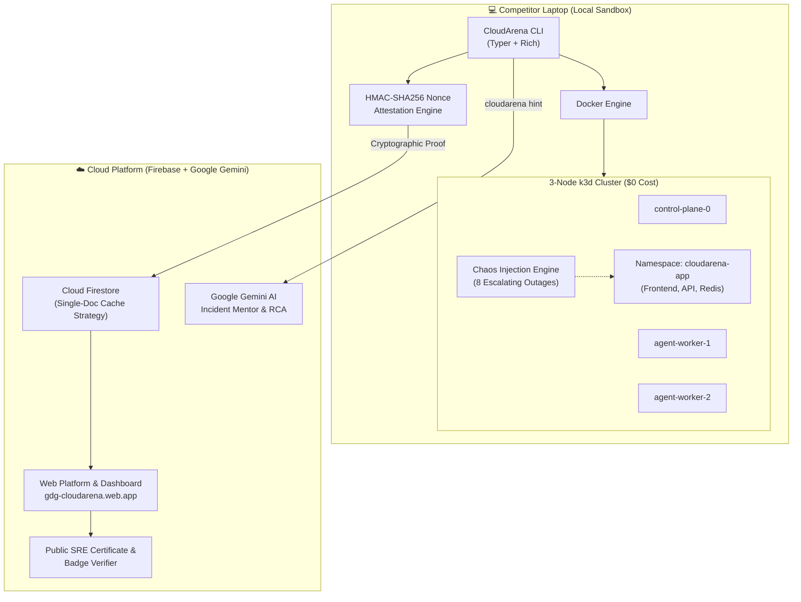

<div align="center">

# 🌩️ CloudArena
### AI-Powered Cloud Infrastructure Survival Arena & SRE Chaos Simulator

> **Survive real-world Kubernetes outages on your own laptop with $0 cloud bills, anti-cheat cryptographic verification, and Google Gemini AI incident mentorship.**

<br/>

[](https://gdg-cloudarena.web.app)
[-00C853?style=for-the-badge&logo=kubernetes&logoColor=white)](https://k3d.io)
[](tests)
[](https://deepmind.google/technologies/gemini/)
[](https://gdg-cloudarena.web.app/verify)
[](https://gdg-cloudarena.web.app)

<br/>

[](https://www.python.org/)
[](LICENSE)
[](https://k3d.io)
[](web)
[](https://gdg-cloudarena.web.app)

<br/>

### 🌐 Live Production Platform & Tournament Portal
### 👉 **[https://gdg-cloudarena.web.app](https://gdg-cloudarena.web.app)** 👈
*Real-time leaderboard, personal token minting, co-op squad passport, auditorium projector mode, and public certificate verifier.*

</div>

---

## ⚡ Hackathon Quickstart (1-Minute Setup)

CloudArena features **automated zero-friction installers** that auto-detect your operating system, check Docker daemon readiness, and download sandboxed tooling into user-space (`~/.cloudarena/bin/`) without touching your global environment.

### 🐧 Linux & 🍎 macOS (Terminal)
```bash
curl -sSL https://gdg-cloudarena.web.app/install.sh | bash
```

### 🪟 Windows (PowerShell as Administrator)
```powershell
irm https://gdg-cloudarena.web.app/install.ps1 | iex
```
*(Alternative Windows direct pip install)*:
```powershell
pip install https://github.com/AdityaPatra-dev/CloudArena/archive/refs/heads/main.zip
```

> 💡 **Zero-PATH Fallback:** If your terminal does not have `~/.local/bin` in `$PATH`, run any command directly with:
> ```bash
> python3 -m cloudarena <command>
> ```

---

## 🎮 The 4-Step Hackathon Battle Loop

```text
  ┌─────────────────┐       ┌─────────────────┐       ┌─────────────────┐       ┌─────────────────┐
  │  1. Link Token  │ ────> │ 2. Start Mesh   │ ────> │ 3. Enter Wave   │ ────> │ 4. Watch & Win  │
  │ cloudarena link │       │ cloudarena start│       │wave start <id>  │       │cloudarena watch │
  └─────────────────┘       └─────────────────┘       └─────────────────┘       └─────────────────┘
```

```bash
# 1. Connect local terminal to live tournament leaderboard
cloudarena link <YOUR_ARENA_TOKEN> --event HACKATHON_2026

# 2. Spin up isolated 3-node k3d cluster ($0 compute cost)
cloudarena start

# 3. Inject incident chaos into the cluster
cloudarena wave start 1

# 4. Investigate & resolve with isolated kubectl proxy
cloudarena kubectl get pods -A
cloudarena kubectl delete pod rogue-crypto-miner -n cloudarena-system

# 5. Continuous traffic stabilization watch & cryptographic HMAC attestation
cloudarena wave watch

# 6. Unlock Gemini AI SRE Root Cause Analysis
cloudarena postmortem 1
```

---

## 🖥️ Live Terminal Simulation

```console
$ cloudarena start
╭────────────────────────────────────────────────────────────╮
│ 🚀 CloudArena Cluster Launcher                             │
│ • Checking prerequisites: Docker Engine ✓, k3d ✓, kubectl ✓│
│ • Creating 3-node mesh (1 server + 2 agents)...            │
│ • Deploying microservices: frontend, backend-api, cache    │
│ ✓ All pods in namespace "cloudarena-app" are Healthy [3/3] │
╰────────────────────────────────────────────────────────────╯

$ cloudarena wave start 1
╭──────────────────────── ⚔️ Wave 1 Injected ────────────────────────╮
│ ⚠️ INCIDENT ACTIVE: Wave 1: Rogue CPU Hog                          │
│ Observed Symptoms: Node CPU saturates at 98.4%; probe latency spikes│
│ Attestation Nonce: hmac_w1_7f8a9b committed to cluster secret.     │
│ Mission: Investigate pods, eliminate rogue workload, restore health│
╰────────────────────────────────────────────────────────────────────╯

$ cloudarena wave watch
📊 CloudArena Real-Time Telemetry Monitor
[████████████████████████████████] 100.0% Traffic Success (120 req/s)
⏱️ Stabilization window: 10.0s / 10.0s [STABLE ✓]
🔐 Cryptographic HMAC proof generated: ca_cert_7f8a9b2c3d4e5f60
🏆 WAVE 1 CLEARED! +500 PTS SYNCED TO LIVE LEADERBOARD.
```

---

## 🌊 The 8 Escalating Chaos Waves

Every wave injects an authentic SRE disaster into your cluster alongside an encrypted HMAC attestation nonce.

| Wave | Incident Code | Difficulty | Target Subsystem | Observed Symptoms | Unlocked Competency |
| :---: | :--- | :---: | :--- | :--- | :--- |
| **01** | `Rogue CPU Hog` | 🟢 Beginner | `cloudarena-system` | Node compute throttled at 98%+; synthetic latency spikes | CFS compute quotas & rogue pod triage |
| **02** | `Memory Exhaustion` | 🟢 Beginner | `cloudarena-app` | Pod repeatedly killed by kernel (Exit Code 137 OOMKilled) | Memory limits & heap profiling |
| **03** | `Broken Health Probe` | 🟡 Intermediate | `cloudarena-app` | Pod restart flapping; HTTP 502 Bad Gateway | Liveness & Readiness probe diagnostics |
| **04** | `Traffic Surge Bottleneck`| 🟡 Intermediate | `traefik-ingress` | 10x synthetic surge; queue starvation | HorizontalPodAutoscaler (HPA) & scaling |
| **05** | `CoreDNS Blackout` | 🟠 Advanced | `kube-system` | Inter-service DNS timeouts; name resolution failure | CoreDNS Corefile policies & cluster IP |
| **06** | `Storage Deadlock` | 🟠 Advanced | `cloudarena-data` | Pod stuck in `ContainerCreating`; ReadOnly file mount | PVC / PV volume access modes |
| **07** | `RBAC Access Denial` | 🔴 Expert | `cloudarena-auth` | ServiceAccount 403 Forbidden on Kubernetes API | RBAC Roles, ClusterRoles & Bindings |
| **08** | `TLS PKI Corruption` | 🟣 Master | `cloudarena-ingress` | Ingress handshake failure; expired & corrupted certs | Ingress TLS secrets & PKI cert rotation |

> ⏱️ **Instant Rollback Engine:** Stumbled down the wrong path? Run `cloudarena reset` to roll back cluster manifests to a clean baseline in **< 3 seconds** without restarting Docker!

---

## 🏛️ End-to-End Architecture



---

## 👥 Co-op Squad Mode (CTF Team Standings)

Team up with 2 to 10 engineers in **Co-op Squad Mode**!
* **Squad Passport:** Cadets generate a shareable Squad Code on the web portal.
* **Collective Scoring:** Incident clearances and speed bonuses aggregate into a unified squad score.
* **Role Specialization:** Assign teammates specialized SRE roles:
  * 🛡️ *Squad Captain*
  * ⚡ *Chaos Specialist*
  * 🔍 *Triage Engineer*
  * 🏗️ *Platform Architect*

---

## 🤖 AI Incident Mentor (Google Gemini SRE)

CloudArena features a built-in AI Incident Mentor providing progressive anti-spoiler clues:
* **Tier 1 (Nudge -10 pts):** Points in the general direction (e.g. check container events).
* **Tier 2 (Guidance -25 pts):** Highlights the specific misconfigured manifest or flag.
* **Tier 3 (Solution -50 pts):** Provides exact kubectl remediation commands.
* **Automated RCA:** Cleared incidents generate a comprehensive Gemini SRE root cause analysis with prevention best practices.

---

## 🛡️ Hardened Security & Anti-Cheat

* **Zero Cloud Bills ($0.00):** Clusters execute completely inside Docker on competitor hardware. Organizers host 2,000+ competitors with zero cloud compute expense.
* **Cryptographic HMAC Attestation:** Waves generate timestamped SHA-256 HMAC nonces stored inside cluster secrets. Scores cannot be faked without resolving the outage on a live running node.
* **OWASP Hardened Web Portal:** Strict Content Security Policy (CSP), HTTP Strict Transport Security (HSTS), Clickjacking prevention (`X-Frame-Options: DENY`), and DOM XSS sanitization.
* **Single-Document Cache Strategy:** High-traffic spectator reads aggregate into a single cached Firestore document (`cached_leaderboard/top100`), reducing read queries by 99.8%.

---

## 📜 Verifiable SRE Certificate & Badge

Every cadet who clears all 8 challenge waves earns a **cryptographically verifiable SRE Certificate** and SVG Badge minted with their unique signature, completion time, and tournament event ID:
* Online verification endpoint: `https://gdg-cloudarena.web.app?verify=<CERT_ID>`
* Fully printable, SVG-rendered, tamper-evident.

---

## 🧪 Comprehensive Test Suite

CloudArena is rigorously tested across all 8 attack scenarios, CLI flags, rollback engines, and telemetry collectors:

```bash
# Run all 99 automated unit tests
python3 -m unittest discover -s tests -v
```

```text
Ran 99 tests in 1.255s
OK (99/99 passing)
```

---

## 📄 License & Community

Released under the **MIT License**. See [LICENSE](LICENSE) for details.

*Built with ❤️ for Google Developer Groups (GDG), student clubs, and Cloud/DevOps communities worldwide.*
