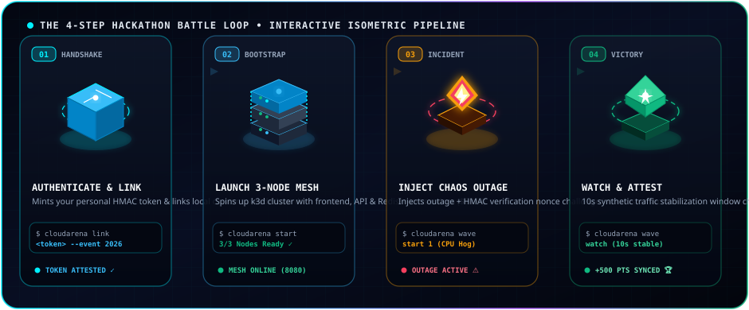
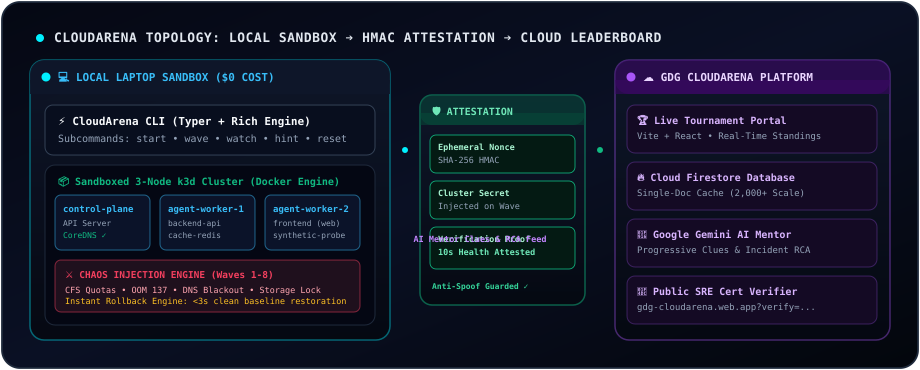

<div align="center">

<!-- Animated Cyber Header Banner SVG -->
<p align="center">
  <a href="https://gdg-cloudarena.web.app">
    
  </a>
</p>

<!-- Live Typewriter Animation via SVG -->
<p align="center">
  <a href="https://gdg-cloudarena.web.app">
    
  </a>
</p>

<!-- Official Event Badges & Hackathon Stickers -->
<p align="center">
  <a href="https://gdg-cloudarena.web.app"></a>
  <a href="https://k3d.io"></a>
  <a href="tests"></a>
  <a href="https://deepmind.google/technologies/gemini/"></a>
  <a href="https://gdg-cloudarena.web.app/verify"></a>
  <a href="https://gdg-cloudarena.web.app"></a>
</p>

<!-- Tech Stack Pills -->
<p align="center">
  
  
  
  
  
</p>

<br/>

### 🌐 Live Production Platform & Tournament Portal
### 👉 **[https://gdg-cloudarena.web.app](https://gdg-cloudarena.web.app)** 👈
*Real-time leaderboard standings, personal token passport minting, co-op squad management, auditorium projector mode, and public SRE certificate verifier.*

</div>

---

## ⚡ 1-Minute Zero-Friction Setup

CloudArena features **automated zero-friction installers** that auto-detect your operating system, verify Docker daemon readiness, and download sandboxed tooling into user-space (`~/.cloudarena/bin/`) without altering your global `~/.kube/config`.

<table width="100%">
<tr>
<td width="50%" valign="top">

### 🐧 Linux & 🍎 macOS (Terminal)
```bash
curl -sSL https://gdg-cloudarena.web.app/install.sh | bash
```

</td>
<td width="50%" valign="top">

### 🪟 Windows (PowerShell as Admin)
```powershell
irm https://gdg-cloudarena.web.app/install.ps1 | iex
```

</td>
</tr>
</table>

> 💡 **Zero-PATH Fallback:** If your terminal does not have `~/.local/bin` in `$PATH`, you never get stuck. Simply prepend `python3 -m`:
> ```bash
> python3 -m cloudarena <command>
> ```

---

## 🎮 The 4-Step Hackathon Battle Loop (3D Isometric Pipeline)

> Every competitor journeys through 4 continuous operational phases—from cryptographic handshake to 3-node cluster orchestration, chaos triage, and live score attestation.

<p align="center">
  
</p>

<table width="100%">
<tr>
<td width="50%" valign="top">

### 01 • 🔑 AUTHENTICATE & LINK
**Terminal Handshake & Telemetry Binding**
Connects your laptop environment to this tournament account and enables cryptographic anti-cheat attestation.
```bash
cloudarena link <ARENA_TOKEN> --event HACKATHON_2026
```
*💡 Mint your personal token at [gdg-cloudarena.web.app](https://gdg-cloudarena.web.app).*

</td>
<td width="50%" valign="top">

### 02 • 🚀 LAUNCH 3-NODE MESH
**Spin Up Sandboxed Cluster ($0 Cost)**
Launches a 3-node k3d mesh (1 server + 2 agents) inside Docker with frontend, API, and Redis microservices ready.
```bash
cloudarena start
```
*💡 Verified [3/3 Pods Ready] in isolated user space.*

</td>
</tr>
<tr>
<td width="50%" valign="top">

### 03 • ⚔️ INJECT CHAOS OUTAGE
**Trigger SRE Incident & Nonce Challenge**
Injects a progressive real-world failure alongside an encrypted HMAC nonce stored directly inside cluster secrets.
```bash
cloudarena wave start 1
```
*💡 Triage pods via `cloudarena kubectl get pods -A`.*

</td>
<td width="50%" valign="top">

### 04 • 🏆 WATCH & ATTEST SCORE
**10s Stabilization & Anti-Cheat Sync**
Monitors live synthetic traffic. Requires 10 consecutive seconds at $\ge 95\%$ success before certifying recovery proof.
```bash
cloudarena wave watch
```
*💡 Posts HMAC attestation proof & syncs +500 pts.*

</td>
</tr>
</table>

---

## 🖥️ Live Terminal Battle Simulation

Watch the complete incident survival loop below—from spinning up the 3-node cluster, injecting chaos, and stabilizing synthetic traffic, to cryptographic score attestation:

<p align="center">
  
</p>

---

## 🌊 The 8 Escalating Chaos Waves

Every wave injects an authentic SRE disaster into your cluster alongside an encrypted HMAC attestation nonce.

| Wave | Incident Code | Difficulty | Target Subsystem | Observed Symptoms | Unlocked Competency |
| :---: | :--- | :---: | :--- | :--- | :--- |
| **01** | `Rogue CPU Hog` | 🟢 Beginner | `cloudarena-system` | Node compute throttled at 98%+; synthetic latency spikes | CFS compute quotas & rogue pod triage |
| **02** | `Memory Exhaustion` | 🟢 Beginner | `cloudarena-app` | Pod repeatedly killed by kernel (Exit Code 137 OOMKilled) | Memory limits & heap profiling |
| **03** | `Broken Health Probe` | 🟡 Intermediate | `cloudarena-app` | Pod restart flapping; HTTP 502 Bad Gateway | Liveness & Readiness probe diagnostics |
| **04** | `Traffic Surge Bottleneck`| 🟡 Intermediate | `traefik-ingress` | 10x synthetic surge; queue starvation | HorizontalPodAutoscaler (HPA) & scaling |
| **05** | `CoreDNS Blackout` | 🟠 Advanced | `kube-system` | Inter-service DNS timeouts; name resolution failure | CoreDNS Corefile policies & cluster IP |
| **06** | `Storage Deadlock` | 🟠 Advanced | `cloudarena-data` | Pod stuck in `ContainerCreating`; ReadOnly file mount | PVC / PV volume access modes |
| **07** | `RBAC Access Denial` | 🔴 Expert | `cloudarena-auth` | ServiceAccount 403 Forbidden on Kubernetes API | RBAC Roles, ClusterRoles & Bindings |
| **08** | `TLS PKI Corruption` | 🟣 Master | `cloudarena-ingress` | Ingress handshake failure; expired & corrupted certs | Ingress TLS secrets & PKI cert rotation |

> ⏱️ **Instant Rollback Engine:** Stumbled down the wrong path? Run `cloudarena reset` to roll back cluster manifests to a clean baseline in **< 3 seconds** without restarting Docker!

---

## 🏛️ End-to-End Architecture & Data Flow

Live animated topology illustrating the local sandboxed cluster, cryptographic nonce verification, and the Google Gemini AI cloud platform:

<p align="center">
  
</p>

---

## 👥 Co-op Squad CTF Mode (Team Standings)

Team up with 2 to 10 engineers in **Co-op Squad Mode**!
* **Squad Passport:** Cadets generate a shareable Squad Code on the web portal.
* **Collective Scoring:** Incident clearances and speed bonuses aggregate into a unified squad score.
* **Role Specialization:** Assign teammates specialized SRE roles:
  * 🛡️ **Squad Captain:** Coordinates triage protocol and syncs team scores.
  * ⚡ **Chaos Specialist:** Isolates rogue workloads and repairs manifests.
  * 🔍 **Triage Engineer:** Analyzes pod logs and inspects container events.
  * 🏗️ **Platform Architect:** Configures autoscaling, storage volumes, and DNS.

```bash
# Link your terminal directly to your squad
cloudarena link <ARENA_TOKEN> --team <SQUAD_CODE>
```

---

## 🤖 AI Incident Mentor (Google Gemini SRE)

CloudArena features a built-in AI Incident Mentor providing progressive anti-spoiler clues:
* **Tier 1 (Nudge -10 pts):** Points in the general direction (e.g., check container events).
* **Tier 2 (Guidance -25 pts):** Highlights the specific misconfigured manifest or flag.
* **Tier 3 (Solution -50 pts):** Provides exact kubectl remediation commands.
* **Automated RCA:** Cleared incidents generate a comprehensive Gemini SRE root cause analysis with prevention best practices.

```bash
# Request guidance (prompts confirmation before deducting points)
cloudarena hint
```

---

## 🛡️ Hardened Security & Anti-Cheat

* **Zero Cloud Bills ($0.00):** Clusters execute completely inside Docker on competitor hardware. Organizers host 2,000+ competitors with zero cloud compute expense.
* **Cryptographic HMAC Attestation:** Waves generate timestamped SHA-256 HMAC nonces stored inside cluster secrets. Scores cannot be faked without resolving the outage on a live running node.
* **OWASP Hardened Web Portal:** Strict Content Security Policy (CSP), HTTP Strict Transport Security (HSTS), Clickjacking prevention (`X-Frame-Options: DENY`), and DOM XSS sanitization.
* **Single-Document Cache Strategy:** High-traffic spectator reads aggregate into a single cached Firestore document (`cached_leaderboard/top100`), reducing read queries by 99.8%.

---

## 📜 Verifiable SRE Certificate & Badge

Every cadet who clears all 8 challenge waves earns a **cryptographically verifiable SRE Certificate** and SVG Badge minted with their unique signature, completion time, and tournament event ID:
* Online verification endpoint: `https://gdg-cloudarena.web.app?verify=<CERT_ID>`
* Fully printable, SVG-rendered, tamper-evident.

---

## 📂 Master Playbooks & Collapsible Deep Dives

<details>
<summary><b>🏆 Hackathon Organizer Quick Guide (Click to Expand)</b></summary>
<br/>

1. **Create Tournament Event:** Sign in at [https://gdg-cloudarena.web.app](https://gdg-cloudarena.web.app) with your Google account.
2. **Elevate to Organizer:** Enter the master passcode `admin2026` in the Organizer Verification card.
3. **Auditorium Projector Mode:** Click the **Projector** button in the navigation bar to launch the high-contrast spectator scoreboard with real-time audio sound effects.
4. **Leaderboard Freeze:** Use the Organizer Command Center to freeze scores during the final 30 minutes for a dramatic reveal ceremony!
</details>

<details>
<summary><b>🧑‍💻 Competitor Troubleshooting & Zero-PATH Guide (Click to Expand)</b></summary>
<br/>

* **Command not recognized?** If you see `bash: cloudarena: command not found`, run:
  ```bash
  export PATH="$HOME/.local/bin:$PATH"
  ```
  Or use Zero-PATH mode:
  ```bash
  python3 -m cloudarena <command>
  ```
* **Docker daemon not running?** Ensure Docker Engine or Docker Desktop is active. CloudArena will automatically notify you if Docker needs to be started.
* **Reset wave without restarting cluster?** Run `cloudarena reset` to wipe out-of-order changes in under 3 seconds!
</details>

<details>
<summary><b>📖 Comprehensive Incident Solutions & Playbook (Click to Expand)</b></summary>
<br/>

For an exhaustive, step-by-step engineering walkthrough of all 8 challenge waves, root cause analyses, diagnostic commands, and solutions, consult:
👉 **[WAVES_MASTER_PLAYBOOK_AND_SOLUTIONS.md](WAVES_MASTER_PLAYBOOK_AND_SOLUTIONS.md)**
</details>

---

## 🧪 Comprehensive Test Suite

CloudArena is rigorously tested across all 8 attack scenarios, CLI flags, rollback engines, and telemetry collectors:

```bash
# Run all 99 automated unit tests
python3 -m unittest discover -s tests -v
```

```text
Ran 99 tests in 1.255s
OK (99/99 passing)
```

---

## 📄 License & Community

Released under the **MIT License**. See [LICENSE](LICENSE) for details.

*Built with ❤️ for Google Developer Groups (GDG), student clubs, and Cloud/DevOps communities worldwide.*
